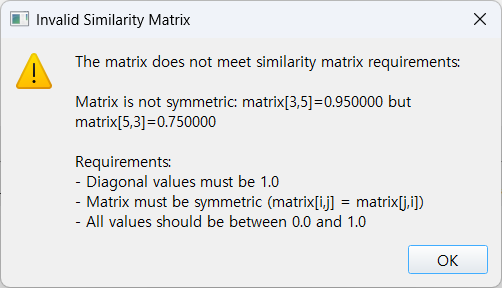

# ACC 사용자 매뉴얼

**ACC (Area Affinity in Concentric Circles)** - 계층적 클러스터 관계 시각화 도구

버전: 2.0
최종 업데이트: 2025-11-15

---

## 목차

1. [소개](#1-소개)
2. [설치](#2-설치)
3. [시작하기](#3-시작하기)
4. [기본 사용법](#4-기본-사용법)
5. [고급 기능](#5-고급-기능)
6. [데이터 형식](#6-데이터-형식)
7. [시각화 해석](#7-시각화-해석)
8. [문제 해결](#8-문제-해결)
9. [FAQ](#9-faq)

## 이미지 목록

매뉴얼 전체에 10개의 스크린샷이 포함되어 있습니다:

1. **메인 화면** - 프로그램 초기 실행 화면
2. **샘플 데이터 로드 완료** - CSV 로드 후 dendrogram 표시
3. **ACC 생성 완료** - 완성된 ACC 동심원 시각화
4. **Matrix 편집** - Upper triangle 편집 및 툴팁
5. **Dendrogram 단계별 보기** - 중간 단계 시각화
6. **ACC 시각화 상세** - 동심원 구조 확대
7. **ACC2 Interactive Features** - Merge point hover
8. **이미지 저장 - 우클릭 메뉴** - 컨텍스트 메뉴
9. **이미지 저장 - 파일 대화상자** - 저장 대화상자
10. **CSV 파일 오류 메시지** - 검증 오류 예시

---

## 1. 소개

### 1.1 ACC란?

ACC(Area Affinity in Concentric Circles)는 계층적 클러스터링 결과를 **동심원 기반 원형 다이어그램**으로 시각화하는 Python 애플리케이션입니다. 두 종류의 유사도 정보(Subordinate와 Inclusive)를 결합하여 영역(area) 간의 친화도(affinity) 관계를 직관적으로 표현합니다.

### 1.2 주요 특징

- **이중 유사도 통합**: Subordinate와 Inclusive 유사도를 동시에 고려
- **대화형 시각화**: 단계별 클러스터링 과정 재생 가능
- **동심원 표현**: 클러스터 계층을 동심원으로 직관적 표현
- **인터랙티브 조정**: Branch swap으로 레이아웃 최적화
- **3단계 워크플로우**: 직관적인 데이터 입력 및 분석 프로세스

### 1.3 사용 사례

- 지역/그룹 간 유사도 관계 분석
- 계층적 클러스터링 결과 시각화
- 생태학적/지리적 데이터 분석
- 계통발생학적 관계 탐색

---

## 2. 설치

### 2.1 시스템 요구사항

- **운영체제**: Windows 10/11, macOS 10.14+, Linux (Ubuntu 18.04+)
- **메모리**: 최소 4GB RAM (권장: 8GB)
- **디스플레이**: 1280x800 이상 권장
- **디스크 공간**: 최소 200MB

### 2.2 프로그램 다운로드

**실행파일 다운로드** (Python 설치 불필요):
1. GitHub Releases 페이지 방문
2. 최신 버전의 `ACC_v[버전].exe` 다운로드
3. 원하는 폴더에 저장

**파일 크기**: 약 80-120MB (모든 필수 라이브러리 포함)

### 2.3 설치 (선택사항)

실행파일은 별도 설치가 필요 없습니다. 다운로드 후 바로 실행 가능합니다.

**권장 설정**:
- 프로그램 전용 폴더 생성 (예: `C:\Program Files\ACC`)
- 샘플 데이터 파일도 함께 저장
- 바탕화면 바로가기 생성 (선택사항)

### 2.4 개발자용 설치

소스코드에서 실행하려면 Python 환경이 필요합니다:

```bash
# Python 3.8 이상 필요
pip install PyQt5 matplotlib scipy pandas numpy

# 또는 requirements.txt 사용
pip install -r requirements.txt
```

실행:
```bash
python acc_gui.py
```

---

## 3. 시작하기

### 3.1 프로그램 실행

**실행파일 사용**:
1. 다운로드한 `ACC_v[버전].exe` 파일을 더블클릭
2. (첫 실행 시) Windows Defender 경고가 나타날 수 있음:
   - "추가 정보" 클릭 → "실행" 선택
3. 프로그램 창이 표시됨

**소스코드 실행** (개발자):
```bash
python acc_gui.py
```

### 3.2 화면 구성

프로그램 실행 시 3열 레이아웃이 표시됩니다:

```
┌─────────────────┬─────────────────┬─────────────────┐
│  Similarity     │  Dendrograms    │  ACC            │
│  Matrices       │                 │  Visualization  │
│  (Left Panel)   │  (Center Panel) │  (Right Panel)  │
└─────────────────┴─────────────────┴─────────────────┘
```

**왼쪽 패널**: Similarity Matrix 표시 및 편집
**중앙 패널**: Dendrogram 시각화
**오른쪽 패널**: ACC 동심원 시각화

---

**[IMAGE 1: 메인 화면]**


---

### 3.3 샘플 데이터로 시작하기

프로젝트에 포함된 샘플 데이터를 사용하여 ACC의 기본 동작을 확인할 수 있습니다.

**샘플 데이터 위치**:
- 프로그램 설치 폴더 내 `data/` 디렉토리
- `sample_subordinate.csv`: 6개 영역(J, T, Y, N, O, Q)의 subordinate similarity
- `sample_inclusive.csv`: 동일한 영역의 inclusive similarity

**빠른 시작 절차**:
1. ACC 프로그램 실행
2. 왼쪽 상단 "Load CSV" 버튼 클릭
   - `data/sample_subordinate.csv` 선택
   - 완성된 dendrogram이 중앙 상단에 자동 표시됨
3. 왼쪽 하단 "Load CSV" 버튼 클릭
   - `data/sample_inclusive.csv` 선택
   - 완성된 dendrogram이 중앙 하단에 자동 표시됨
4. 오른쪽 패널에서 "Generate ACC Visualization" 버튼 클릭
   - 완성된 ACC 동심원이 자동 표시됨

**참고**: CSV 로드 후 dendrogram과 ACC가 자동으로 마지막 단계(완성된 상태)로 표시됩니다. 단계별 과정을 보려면 슬라이더를 왼쪽으로 이동하세요.

---

**[IMAGE 2: 샘플 데이터 로드 완료]**


---

**[IMAGE 3: ACC 생성 완료]**


---

## 4. 기본 사용법

### 4.1 전체 워크플로우

ACC는 3단계 워크플로우로 구성됩니다:

#### **Step 1: Subordinate Matrix 로드**

1. 왼쪽 패널 상단의 **"Subordinate Similarity Matrix"** 섹션으로 이동
2. **[Load CSV]** 버튼 클릭
3. Subordinate similarity matrix CSV 파일 선택
4. 매트릭스 데이터 확인
5. **Dendrogram 자동 생성 및 표시** - 중앙 패널 상단에 완성된 dendrogram이 즉시 표시됨

**자동 처리**:
- CSV 파일 검증 (대칭성, 대각선 1.0 체크)
- Hierarchical clustering 수행
- Dendrogram 생성
- 슬라이더 자동으로 마지막 단계로 이동
- 완성된 dendrogram 즉시 표시

#### **Step 2: Inclusive Matrix 로드**

1. 왼쪽 패널 하단의 **"Inclusive Similarity Matrix"** 섹션으로 이동
2. **[Load CSV]** 버튼 클릭
3. Inclusive similarity matrix CSV 파일 선택
4. 매트릭스 데이터 확인
5. **Dendrogram 자동 생성 및 표시** - 중앙 패널 하단에 완성된 dendrogram이 즉시 표시됨

**중요**:
- Subordinate와 Inclusive matrix는 동일한 라벨(지역/객체 이름)을 가져야 합니다.
- 로드 후 완성된 dendrogram이 자동으로 표시됩니다. 단계별 과정을 보려면 슬라이더를 조작하세요.

#### **Step 3: ACC 시각화 생성**

1. 오른쪽 패널로 이동
2. **[Generate ACC Visualization]** 버튼 클릭
3. ACC 알고리즘 실행
4. **완성된 동심원이 자동으로 표시됨**

**또는** ACC2 시각화:
- **[Generate ACC2]** 버튼 클릭하여 개선된 ACC2 알고리즘 사용
- ACC2도 마찬가지로 완성된 시각화가 즉시 표시됨

**참고**:
- 생성 후 자동으로 마지막 단계(완성된 ACC)가 표시됩니다.
- 단계별 클러스터 병합 과정을 보려면 슬라이더를 왼쪽으로 이동하세요.

### 4.2 Matrix 편집

#### Area List 편집

1. Similarity Matrix 섹션에서 **[Edit Area List]** 버튼 클릭
2. Area List Editor 다이얼로그 표시
3. 기능:
   - **Add**: 새로운 지역 추가
   - **Remove**: 선택한 지역 삭제
   - **Move Up/Down**: 지역 순서 변경
4. **[OK]** 클릭하여 변경사항 적용

**주의**: Area 추가/삭제 시 매트릭스는 기본값(0.5 또는 1.0)으로 초기화됩니다.

#### Matrix 값 편집

**편집 가능 영역**: Upper triangle (상삼각 영역)만 편집 가능

1. Matrix 테이블의 **상삼각 영역** 셀을 더블클릭
2. 값 입력 (0.0 ~ 1.0 범위)
3. Enter 키로 확인

**Matrix 테이블 구조**:
```
      J     T     Y     N
J   [회색] 0.900 0.800 0.400  ← Upper triangle (편집 가능)
T   [회색][회색] 0.800 0.380
Y   [회색][회색][회색] 0.370
N   [회색][회색][회색][회색]
    ↑
    Lower triangle (회색, 편집 불가)
```

**제약사항**:
- **대각선** (회색): 항상 1.0, 빈 셀로 표시 (편집 불가)
  - 마우스 오버 시 툴팁: "Diagonal cells are always 1.0 (not shown)"
- **Lower triangle** (회색): 빈 셀로 표시, Upper triangle의 미러 값 (편집 불가)
  - 마우스 오버 시 툴팁: "Lower triangle is mirrored from upper triangle (not shown)"
- **Upper triangle**: 편집 가능, 0.0 ~ 1.0 범위
- **대칭성 자동 유지**: Upper triangle 값 수정 시 Lower triangle 자동 반영

**편집 팁**:
- 회색 셀에 마우스를 올리면 해당 셀이 왜 편집 불가인지 툴팁으로 확인 가능
- Upper triangle만 값을 입력하면 대칭성이 자동으로 유지됨

---

**[IMAGE 4: Matrix 편집]**


---

### 4.3 Dendrogram 단계별 보기

중앙 패널에서 클러스터링 과정을 단계별로 관찰할 수 있습니다.

#### 컨트롤

```
⏮  ◀  [슬라이더]  ▶  ⏭
```

- **⏮ (First)**: 첫 단계로 이동 (개별 영역들)
- **◀ (Previous)**: 이전 단계
- **[슬라이더]**: 원하는 단계로 직접 이동
- **▶ (Next)**: 다음 단계 (병합 애니메이션 포함)
- **⏭ (Last)**: 마지막 단계 (모든 클러스터 병합 완료)

#### 각 단계에서 확인 가능한 정보

- **병합되는 클러스터**: 빨간색 하이라이트
- **병합 후 클러스터**: 파란색 하이라이트
- **유사도 값**: 화면 하단에 표시
- **단계 설명**: "Step X/Y: Merging clusters..."

**특징**:
- **첫 단계** (Step 0): 원본 매트릭스 표시, 클러스터링 전 상태
- **중간 단계** (Step 1~N-1): 부분적으로 병합된 dendrogram, 진행 중인 클러스터는 파란색으로 표시
- **마지막 단계** (Step N): 모든 클러스터가 하나로 병합된 완성된 dendrogram → 원본 매트릭스가 다시 표시됨

**CSV 로드 시 자동으로 마지막 단계로 이동**하여 완성된 결과를 즉시 확인할 수 있습니다.

---

**[IMAGE 5: Dendrogram 단계별 보기]**


---

### 4.4 ACC 시각화 읽기

#### 동심원 구조

ACC 시각화는 여러 겹의 동심원으로 구성됩니다:

```
        ┌──────────────┐
        │ Outer Circle │  ← 낮은 inclusive similarity
        │  ┌────────┐  │
        │  │ Middle │  │
        │  │ ┌────┐ │  │
        │  │ │Core│ │  │  ← 높은 inclusive similarity
        │  │ └────┘ │  │
        │  └────────┘  │
        └──────────────┘
```

**원의 의미**:
- **가장 안쪽 원** (보라색): 개별 영역들 (Areas)
- **중간 원들** (파란색~초록색): 클러스터 레벨, inc_sim 값으로 라벨 표시
- **원 간 거리**: Inclusive similarity에 비례

#### 각도 (Angle)

- 같은 원 위의 점들 간 각도는 **Subordinate similarity**를 반영
- 각도가 작을수록 유사도가 높음
- 0도 기준: 위쪽 (0, 1) 방향

#### 색상 코드

- **검은색 점**: 개별 영역 (Area)
- **파란색 라벨**: 영역 이름
- **빨간색 점**: Merge point (ACC2)
- **회색 선**: 계층 연결선

---

**[IMAGE 6: ACC 시각화 상세]**


---

## 5. 고급 기능

### 5.1 ACC2 Interactive Features

ACC2는 ACC의 개선 버전으로, 추가적인 인터랙티브 기능을 제공합니다.

#### Merge Point Hover

1. 빨간색 merge point에 마우스를 올립니다
2. 노란색 툴팁 박스가 표시됩니다:
   ```
   Cluster: [J, T]
   Angle: 45.2°
   Sub sim: 0.900
   ```

**표시 정보**:
- **Cluster**: 병합된 영역들
- **Angle**: 극좌표 각도
- **Sub sim**: Subordinate similarity

#### Branch Swap

Merge point를 클릭하여 좌우 branch를 교환할 수 있습니다.

**사용법**:
1. 원하는 merge point 클릭
2. 두 branch가 merge angle 기준으로 mirror됨
3. 화면 하단에 swap 상태 표시: "Swapped: levels [2, 5]"
4. 다시 클릭하면 원래대로 복구

**활용**:
- 시각적으로 더 명확한 레이아웃 생성
- 특정 클러스터 강조
- 비교 분석 용이

**제약사항**:
- Dendrogram 구조는 변경되지 않음 (시각적 배치만 변경)
- Swap 상태는 세션 내에서만 유지
- 재생성 시 초기화

---

**[IMAGE 7: ACC2 Interactive Features]**


---

### 5.2 이미지 저장

Dendrogram과 ACC 시각화를 이미지 파일로 저장할 수 있습니다.

#### 방법: 우클릭 메뉴 (권장)

1. **Dendrogram 또는 ACC 시각화 영역에서 우클릭**
2. 컨텍스트 메뉴에서 **"Save Image As..."** 선택
3. 저장 대화상자에서:
   - 파일 이름 입력
   - 파일 형식 선택 (PNG/PDF/SVG)
   - 저장 위치 지정
4. **[저장]** 클릭

---

**[IMAGE 8: 이미지 저장 - 우클릭 메뉴]**


---

**[IMAGE 9: 이미지 저장 - 파일 대화상자]**


---

**지원하는 파일 형식**:
- **PNG Files (*.png)**: 래스터 이미지, 일반적인 용도
- **PDF Files (*.pdf)**: 벡터 이미지, 출판용
- **SVG Files (*.svg)**: 벡터 이미지, 추가 편집용 (Illustrator 등)

**저장 설정**:
- **해상도**: 300 DPI (고품질)
- **여백 처리**: bbox_inches='tight' (자동 여백 조정)

#### 기본 파일명

- **Subordinate Dendrogram**: `Subordinate_dendrogram.png`
- **Inclusive Dendrogram**: `Inclusive_dendrogram.png`
- **ACC Visualization**: `ACC_visualization.png`

파일명은 저장 시 자유롭게 변경 가능합니다.

#### 활용 예시

**논문/발표 자료용**:
- 형식: PDF 또는 PNG (300 DPI)
- 용도: 고품질 인쇄물

**웹/문서용**:
- 형식: PNG
- 용도: 온라인 공유, 보고서

**추가 편집용**:
- 형식: SVG
- 용도: Illustrator, Inkscape 등에서 편집

### 5.3 로그 확인

프로그램 동작 상세 정보는 개발자 모드에서 확인할 수 있습니다.

**개발자 모드 (Python 소스코드 실행 시)**:
```bash
python acc_gui.py
```

콘솔 창에서 다음과 같은 로그를 확인할 수 있습니다:

**로그 레벨**:
- **INFO**: 일반 동작 정보 (CSV 로드, ACC 생성 등)
- **WARNING**: 주의사항 (데이터 검증 경고)
- **ERROR**: 오류 발생 (파일 로드 실패, 계산 오류)

**실행파일 버전**:
- 로그가 콘솔에 표시되지 않음
- 오류 발생 시 대화상자로 메시지 표시
- 상세 디버깅이 필요한 경우 Python 소스코드 버전 사용

---

## 6. 데이터 형식

### 6.1 CSV 파일 형식

Similarity matrix CSV는 다음 규칙을 따라야 합니다:

#### 기본 구조

```csv
,J,T,Y,N,O,Q
J,1.0,0.9,0.8,0.4,0.35,0.36
T,0.9,1.0,0.8,0.38,0.33,0.34
Y,0.8,0.8,1.0,0.37,0.32,0.33
N,0.4,0.38,0.37,1.0,0.75,0.75
O,0.35,0.33,0.32,0.75,1.0,0.85
Q,0.36,0.34,0.33,0.75,0.85,1.0
```

#### 필수 조건

1. **첫 행**: 컬럼 헤더 (라벨 이름)
2. **첫 열**: 로우 인덱스 (라벨 이름, 헤더와 동일 순서)
3. **대각선**: 모든 값이 1.0
4. **대칭성**: matrix[i][j] == matrix[j][i]
5. **값 범위**: 0.0 ~ 1.0
6. **라벨 일치**: Subordinate와 Inclusive matrix가 동일한 라벨 사용

#### 잘못된 예시

```csv
# ❌ 첫 행 누락
J,1.0,0.9,0.8
T,0.9,1.0,0.8

# ❌ 대칭성 위반
,J,T
J,1.0,0.9
T,0.8,1.0  ← 0.9여야 함

# ❌ 범위 초과
,J,T
J,1.0,1.5  ← 1.0 초과
T,1.5,1.0

# ❌ 대각선이 1.0이 아님
,J,T
J,0.9,0.8  ← 1.0이어야 함
T,0.8,1.0
```

---

**[IMAGE 10: CSV 파일 오류 메시지]**


---

### 6.2 데이터 준비 가이드

#### Excel에서 CSV 생성

1. Excel에서 similarity matrix 작성
2. 첫 행과 첫 열에 동일한 라벨 입력
3. 대각선을 1.0으로 설정
4. 대칭 값 입력 (수식 사용 가능: `=INDEX($B$2:$G$7, COLUMN()-1, ROW()-1)`)
5. "다른 이름으로 저장" → "CSV (쉼표로 분리)" 선택

#### Python으로 생성

```python
import pandas as pd
import numpy as np

# 라벨 정의
labels = ['J', 'T', 'Y', 'N', 'O', 'Q']

# 빈 매트릭스 생성 (대각선 1.0)
n = len(labels)
matrix = np.eye(n)

# 상삼각 값 입력 (예시)
matrix[0, 1] = 0.9  # J-T
matrix[0, 2] = 0.8  # J-Y
# ... 추가 값 입력

# 대칭화
matrix = matrix + matrix.T - np.diag(np.diag(matrix))

# DataFrame 생성 및 저장
df = pd.DataFrame(matrix, index=labels, columns=labels)
df.to_csv('subordinate.csv')
```

### 6.3 데이터 검증

CSV 파일 로드 시 자동으로 다음 사항을 검증합니다:

- ✓ 파일 형식 (CSV)
- ✓ 대칭성
- ✓ 대각선 값 (1.0)
- ✓ 값 범위 (0.0 ~ 1.0)
- ✓ 라벨 일치 (Subordinate ↔ Inclusive)

오류 발생 시 상세한 메시지가 표시됩니다.

---

## 7. 시각화 해석

### 7.1 알고리즘 이해

ACC는 다음 공식을 사용합니다:

#### Diameter (지름)
```
d = 1 + (1 - sim_inc)
```

- **sim_inc가 높을수록** → d가 작음 → **중심에 가까움**
- **sim_inc가 낮을수록** → d가 큼 → **바깥쪽에 위치**

예시:
- sim_inc = 0.9 → d = 1.1 (중심 근처)
- sim_inc = 0.5 → d = 1.5 (바깥쪽)

#### Angle (각도)
```
θ = 180° × (1 - sim_sub)
```

- **sim_sub가 높을수록** → θ가 작음 → **가까운 각도**
- **sim_sub가 낮을수록** → θ가 큼 → **먼 각도**

예시:
- sim_sub = 0.9 → θ = 18° (가까움)
- sim_sub = 0.5 → θ = 90° (직각)

### 7.2 시각화 패턴 읽기

#### 패턴 1: 타이트한 클러스터

```
    J
   / \
  T   Y
```

**특징**:
- 작은 각도 차이
- 동일한 원 위에 위치
- 높은 subordinate similarity

**해석**: J, T, Y는 매우 유사한 그룹

#### 패턴 2: 계층적 구조

```
         Root
        /    \
    Group1  Group2
    /  \      /  \
   J    T    N    O
```

**특징**:
- 여러 레벨의 동심원
- 안쪽 → 바깥쪽으로 계층 형성

**해석**: 명확한 상하 계층 구조

#### 패턴 3: 고립된 영역

```
J T Y         Q
 ∙∙∙    →    ∙  ← 멀리 떨어짐
```

**특징**:
- 큰 각도 차이
- 다른 원에 위치

**해석**: Q는 다른 영역들과 유사도가 낮음

### 7.3 두 Similarity의 역할

#### Subordinate Similarity
- **역할**: 같은 레벨 내에서의 상대적 위치 결정
- **영향**: 각도 (angular position)
- **해석**: "얼마나 가까운가?"

#### Inclusive Similarity
- **역할**: 계층 레벨 결정
- **영향**: 반지름 (radial position)
- **해석**: "어느 레벨에 속하는가?"

**예시**:
```
영역 A, B:
- sub_sim = 0.9 (높음) → 작은 각도 차이 → 가까이 위치
- inc_sim = 0.5 (낮음) → 큰 반지름 → 바깥쪽 원

영역 C, D:
- sub_sim = 0.5 (낮음) → 큰 각도 차이 → 멀리 위치
- inc_sim = 0.9 (높음) → 작은 반지름 → 안쪽 원
```

---

## 8. 문제 해결

### 8.1 일반적인 오류

#### 오류: "Matrix is not symmetric"

**원인**: CSV 파일의 [i,j]와 [j,i] 값이 다름

**해결**:
1. CSV 파일을 Excel로 열기
2. 대칭성 확인: `A[i][j] == A[j][i]`
3. 틀린 값 수정
4. 다시 저장 후 로드

**예방**: Excel에서 수식으로 대칭성 보장
```
=INDEX($B$2:$G$7, COLUMN()-1, ROW()-1)
```

#### 오류: "Diagonal values must be 1.0"

**원인**: 대각선 (자기 자신과의 유사도)이 1.0이 아님

**해결**:
1. 대각선 셀 확인 (J-J, T-T, Y-Y, ...)
2. 모두 1.0으로 수정

#### 오류: "Labels do not match"

**원인**: Subordinate와 Inclusive matrix의 라벨이 다름

**해결**:
1. 두 CSV 파일의 첫 행과 첫 열 비교
2. 라벨 이름과 순서를 동일하게 수정

**예시**:
```
# Subordinate: J, T, Y, N, O, Q
# Inclusive:   J, T, Y, N, Q, O  ← 순서 다름

→ Inclusive를 J, T, Y, N, O, Q 순서로 재정렬
```

#### 오류: "Value out of range"

**원인**: 유사도 값이 0.0 ~ 1.0 범위를 벗어남

**해결**:
1. 범위 밖의 값 찾기
2. 0.0 ~ 1.0 사이로 수정
3. 필요시 정규화 수행

### 8.2 GUI 문제

#### Windows Defender 경고

**증상**: "Windows에서 PC를 보호했습니다" 메시지

**원인**: 서명되지 않은 실행파일에 대한 표준 경고

**해결**:
1. "추가 정보" 클릭
2. "실행" 버튼 클릭
3. 프로그램이 정상적으로 시작됨

**안전성**: 이 프로그램은 오픈소스이며 악성코드가 아닙니다.

#### 프로그램이 시작되지 않음

**증상**: 더블클릭 후 아무 일도 일어나지 않음

**해결**:
1. 명령 프롬프트(cmd)에서 실행하여 오류 확인:
   ```
   C:\> ACC_v[버전].exe
   ```
2. 오류 메시지 확인 후 해당 문제 해결
3. 관리자 권한으로 실행 시도 (우클릭 → "관리자 권한으로 실행")

#### 화면이 표시되지 않음

**증상**: 프로그램 실행되지만 빈 화면

**해결**:
1. 프로그램 재시작
2. 다른 PC에서 테스트
3. 백신 프로그램 예외 설정 추가
4. 최신 버전 다운로드

#### Dendrogram이 생성되지 않음

**원인**: 데이터 부족 (최소 3개 영역 필요)

**해결**:
- 최소 3개 이상의 영역으로 데이터 준비

#### 개발자용: Python 환경 문제

**PyQt5 설치 문제**:
```bash
pip uninstall PyQt5
pip install PyQt5==5.15.9
```

**matplotlib 오류**:
```bash
pip uninstall matplotlib
pip install matplotlib
```

### 8.3 성능 문제

#### 느린 시각화

**원인**: 대규모 데이터 (50개 이상 영역)

**해결**:
1. 데이터 필터링 (주요 영역만 선택)
2. 계층 레벨 제한
3. 하드웨어 업그레이드 고려

#### 메모리 부족

**원인**: 대규모 매트릭스 (100x100 이상)

**해결**:
1. 데이터 샘플링
2. 배치 처리
3. 메모리 증설

---

## 9. FAQ

### Q1: Subordinate와 Inclusive similarity의 차이는?

**A**:
- **Subordinate**: 주요 계층 구조를 나타냄 (각도 결정)
- **Inclusive**: 보조 유사도 정보 (반지름 결정)

두 가지 다른 관점의 유사도를 결합하여 더 풍부한 시각화를 생성합니다.

### Q2: 동일한 데이터를 두 번 사용해도 되나요?

**A**: 네, 가능합니다. 같은 CSV를 Subordinate와 Inclusive 모두에 로드하면:
- 각도와 반지름이 동일한 유사도로 결정됨
- 단순한 계층 구조 시각화 가능

### Q3: 라벨 순서가 중요한가요?

**A**: 네, 중요합니다.
- Subordinate와 Inclusive matrix의 라벨 순서가 동일해야 함
- 순서가 다르면 오류 발생
- Matrix 값은 라벨 기준으로 매칭됨

### Q4: 몇 개의 영역까지 지원하나요?

**A**:
- **이론적 제한**: 없음
- **실용적 권장**: 최대 50개
- **시각화 품질**: 20개 이하에서 최적

너무 많은 영역은 시각화를 복잡하게 만듭니다.

### Q5: CSV 인코딩은?

**A**: UTF-8을 권장합니다.
- Excel에서 저장 시 "CSV UTF-8" 선택
- 한글/특수문자 사용 가능
- BOM 있어도 자동 처리

### Q6: Branch swap은 분석에 영향을 주나요?

**A**: 아니요.
- Branch swap은 시각적 배치만 변경
- Dendrogram 구조, 유사도 값은 불변
- 분석 결과에 영향 없음
- 가독성 향상 목적

### Q7: 결과를 논문에 사용할 수 있나요?

**A**: 네, 가능합니다.
- 고해상도 이미지 저장 (PDF/SVG 권장)
- DPI 300 이상 설정
- 라이선스: MIT (자유롭게 사용 가능)

**인용 예시**:
```
Visualization created using ACC (Area Affinity in Concentric Circles)
https://github.com/[repository-url]
```

### Q8: ACC와 ACC2의 차이는?

**A**:
- **ACC**: 원본 알고리즘, 안정적
- **ACC2**: 개선 버전, 추가 기능:
  - Branch swap
  - Merge point hover
  - 향상된 동심원 라벨링
  - 더 직관적인 레이아웃

대부분의 경우 ACC2 사용을 권장합니다.

### Q9: 데이터를 프로그래밍 방식으로 입력할 수 있나요?

**A**: 실행파일 버전은 GUI만 지원합니다.

프로그래밍 방식으로 사용하려면 Python 소스코드를 사용하세요:

```python
from acc_core import build_acc, DendroNode

# Dendrogram 구조 생성
sub_dendro = DendroNode(...)
inc_dendro = DendroNode(...)
inc_matrix = {...}

# ACC 실행
result = build_acc(sub_dendro, inc_dendro, inc_matrix)

# 결과 접근
print(result["points"])  # 좌표
print(result["diameter"])
print(result["theta"])
```

자세한 내용은 GitHub의 `CLAUDE.md` 참조.

### Q10: 오류 발생 시 어떻게 해야 하나요?

**A**:
1. 오류 메시지 확인
2. 이 매뉴얼의 "문제 해결" 섹션 참조
3. 로그 확인 (콘솔 출력)
4. GitHub Issues에 문의

**이슈 제보 시 포함할 내용**:
- 오류 메시지 전문
- 사용한 CSV 파일 (샘플)
- Python 버전
- 라이브러리 버전 (`pip list`)

---

## 부록

### A. 샘플 데이터

프로그램과 함께 제공되는 샘플 데이터:

**data/sample_subordinate.csv**:
```csv
,J,T,Y,N,O,Q
J,1.0,0.9,0.8,0.4,0.35,0.36
T,0.9,1.0,0.8,0.38,0.33,0.34
Y,0.8,0.8,1.0,0.37,0.32,0.33
N,0.4,0.38,0.37,1.0,0.75,0.75
O,0.35,0.33,0.32,0.75,1.0,0.85
Q,0.36,0.34,0.33,0.75,0.85,1.0
```

**data/sample_inclusive.csv**:
```csv
,J,T,Y,N,O,Q
J,1.0,0.88,0.82,0.4,0.35,0.36
T,0.88,1.0,0.8,0.38,0.33,0.34
Y,0.82,0.8,1.0,0.37,0.32,0.33
N,0.4,0.38,0.37,1.0,0.7,0.68
O,0.35,0.33,0.32,0.7,1.0,0.83
Q,0.36,0.34,0.33,0.68,0.83,1.0
```

이 데이터는 6개 지역(J, T, Y, N, O, Q)의 유사도를 나타냅니다.

### B. 키보드 단축키

현재 버전에는 키보드 단축키가 제한적입니다.

| 단축키 | 기능 |
|--------|------|
| Ctrl+O | CSV 파일 열기 (개발 예정) |
| Ctrl+S | 시각화 저장 (개발 예정) |
| Space | Next step (개발 예정) |

### C. 추가 리소스

- **GitHub Repository**: [프로젝트 URL]
- **소스코드**: Python으로 작성됨 (PyQt5 + matplotlib)
- **알고리즘 상세**: README.md 및 CLAUDE.md 참조
- **이슈 리포팅**: GitHub Issues

### D. 라이선스

MIT License

Copyright (c) 2025 ACC Project

Permission is hereby granted, free of charge, to any person obtaining a copy of this software...

---

## 변경 이력

### Version 2.0 (2025-11-15)
- **사용자 경험 개선**:
  - Matrix 로드 후 dendrogram 자동으로 마지막 단계 표시
  - ACC 생성 후 완성된 시각화 자동 표시
  - 우클릭으로 이미지 저장 기능 (PNG/PDF/SVG)
- **문서화**:
  - 포괄적인 사용자 매뉴얼 작성 (856줄)
  - ACC 약어 정확히 수정 (Area Affinity in Concentric Circles)
  - Matrix 편집 UI 상세 설명
- **ACC2 알고리즘**:
  - Interactive features (merge point hover, branch swap)
  - 향상된 동심원 라벨링
- **UI 개선**:
  - Navigation 버튼 추가 (⏮ ⏭)
  - 단계별 시각화 제어 향상

### Version 1.0 (2025-11-13)
- 초기 릴리스
- 기본 ACC 알고리즘
- PyQt5 기반 GUI 구현
- CSV matrix 입력 지원
- Dendrogram 단계별 시각화

---

**매뉴얼 끝**

질문이나 제안사항은 GitHub Issues를 통해 문의해 주세요.
