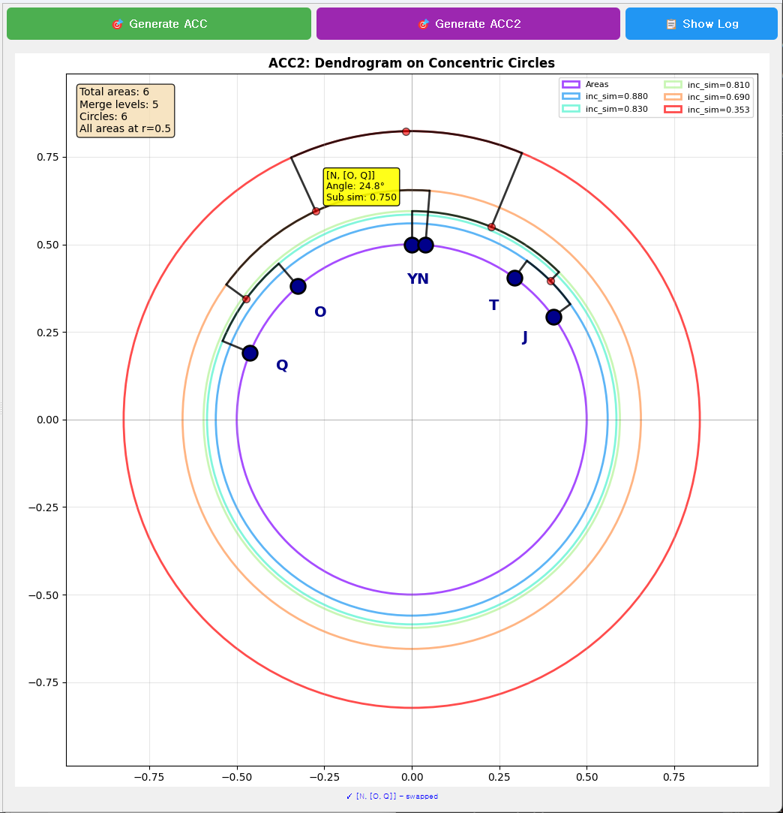
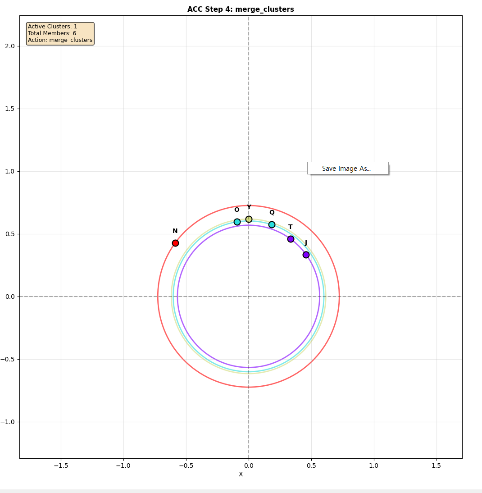

고급 기능
=========

ACC2 Interactive Features
---------------------------

ACC2는 ACC의 개선 버전으로, 추가적인 인터랙티브 기능을 제공합니다.

Merge Point Hover
~~~~~~~~~~~~~~~~~

1. 빨간색 merge point에 마우스를 올립니다
2. 노란색 툴팁 박스가 표시됩니다:

.. code-block:: text

   Cluster: [J, T]
   Angle: 45.2°
   Sub sim: 0.900

표시 정보
^^^^^^^^^

* **Cluster**: 병합된 영역들
* **Angle**: 극좌표 각도
* **Sub sim**: Local similarity

Branch Swap
~~~~~~~~~~~

Merge point를 클릭하여 좌우 branch를 교환할 수 있습니다.

사용법
^^^^^^

1. 원하는 merge point 클릭
2. 두 branch가 merge angle 기준으로 mirror됨
3. 화면 하단에 swap 상태 표시: "Swapped: levels [2, 5]"
4. 다시 클릭하면 원래대로 복구

활용
^^^^

* 시각적으로 더 명확한 레이아웃 생성
* 특정 클러스터 강조
* 비교 분석 용이

제약사항
^^^^^^^^

* Dendrogram 구조는 변경되지 않음 (시각적 배치만 변경)
* Swap 상태는 세션 내에서만 유지
* 재생성 시 초기화

   ACC2의 인터랙티브 기능을 보여줍니다. 멤버를 선택하면 하이라이트되며, Swap 기능으로 형제 클러스터의 위치를 바꿀 수 있습니다.

이미지 저장
-----------

Dendrogram과 ACC 시각화를 이미지 파일로 저장할 수 있습니다.

방법: 우클릭 메뉴 (권장)
~~~~~~~~~~~~~~~~~~~~~~~~

1. **Dendrogram 또는 ACC 시각화 영역에서 우클릭**
2. 컨텍스트 메뉴에서 **"Save Image As..."** 선택
3. 저장 대화상자에서:

   * 파일 이름 입력
   * 파일 형식 선택 (PNG/PDF/SVG)
   * 저장 위치 지정

4. **[저장]** 클릭

   시각화 영역에서 우클릭하면 나타나는 메뉴입니다. "Save Image As..." 옵션을 선택하여 이미지를 저장할 수 있습니다.

.. figure:: images/09_save_dialog.png
   :alt: 이미지 저장 대화상자
   :align: center

   파일 저장 대화상자에서 파일 형식(PNG, PDF, SVG)과 저장 위치를 선택할 수 있습니다.

지원하는 파일 형식
~~~~~~~~~~~~~~~~~~

* **PNG Files (*.png)**: 래스터 이미지, 일반적인 용도
* **PDF Files (*.pdf)**: 벡터 이미지, 출판용
* **SVG Files (*.svg)**: 벡터 이미지, 추가 편집용 (Illustrator 등)

저장 설정
~~~~~~~~~

* **해상도**: 300 DPI (고품질)
* **여백 처리**: bbox_inches='tight' (자동 여백 조정)

기본 파일명
~~~~~~~~~~~

* **Local Dendrogram**: ``Local_dendrogram.png``
* **Global Dendrogram**: ``Global_dendrogram.png``
* **ACC Visualization**: ``ACC_visualization.png``

파일명은 저장 시 자유롭게 변경 가능합니다.

활용 예시
~~~~~~~~~

**논문/발표 자료용**:

* 형식: PDF 또는 PNG (300 DPI)
* 용도: 고품질 인쇄물

**웹/문서용**:

* 형식: PNG
* 용도: 온라인 공유, 보고서

**추가 편집용**:

* 형식: SVG
* 용도: Illustrator, Inkscape 등에서 편집

로그 확인
----------

프로그램 동작 상세 정보는 개발자 모드에서 확인할 수 있습니다.

개발자 모드 (Python 소스코드 실행 시)
~~~~~~~~~~~~~~~~~~~~~~~~~~~~~~~~~~~~~

.. code-block:: bash

   python acc_gui.py

콘솔 창에서 다음과 같은 로그를 확인할 수 있습니다:

로그 레벨
^^^^^^^^^

* **INFO**: 일반 동작 정보 (CSV 로드, ACC 생성 등)
* **WARNING**: 주의사항 (데이터 검증 경고)
* **ERROR**: 오류 발생 (파일 로드 실패, 계산 오류)

실행파일 버전
~~~~~~~~~~~~~

* 로그가 콘솔에 표시되지 않음
* 오류 발생 시 대화상자로 메시지 표시
* 상세 디버깅이 필요한 경우 Python 소스코드 버전 사용

다음 단계
----------

고급 기능을 활용하려면 :doc:`data_format` 에서 CSV 파일 형식을 확인하세요.
