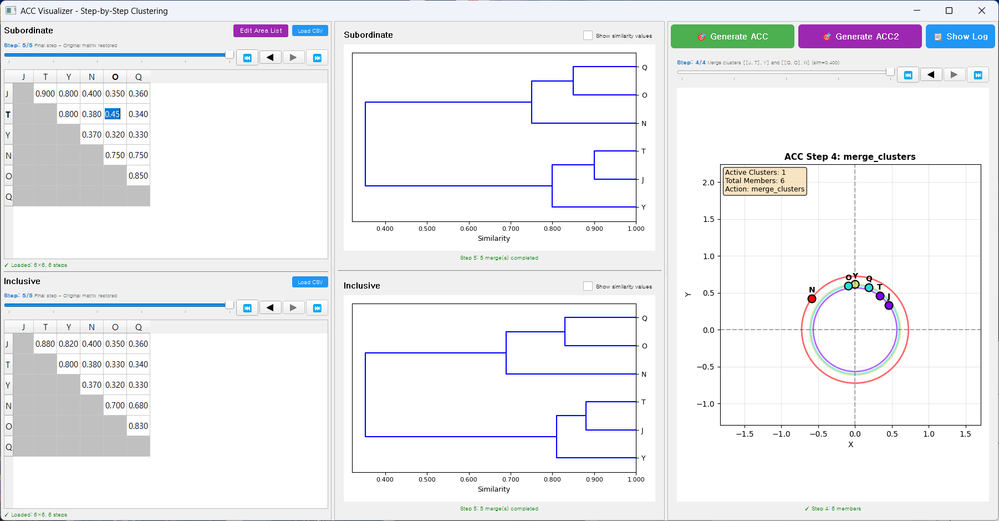

기본 사용법
===========

Matrix 편집
-----------

Area List 편집
~~~~~~~~~~~~~~

1. Similarity Matrix 섹션에서 **[Edit Area List]** 버튼 클릭
2. Area List Editor 다이얼로그 표시
3. 기능:

   * **Add**: 새로운 지역 추가
   * **Remove**: 선택한 지역 삭제
   * **Move Up/Down**: 지역 순서 변경

4. **[OK]** 클릭하여 변경사항 적용

.. warning::

   Area 추가/삭제 시 매트릭스는 기본값(0.5 또는 1.0)으로 초기화됩니다.

Matrix 값 편집
~~~~~~~~~~~~~~

**편집 가능 영역**: Upper triangle (상삼각 영역)만 편집 가능

1. Matrix 테이블의 **상삼각 영역** 셀을 더블클릭
2. 값 입력 (0.0 ~ 1.0 범위)
3. Enter 키로 확인

Matrix 테이블 구조
^^^^^^^^^^^^^^^^^^

.. code-block:: text

         J     T     Y     N
   J   [회색] 0.900 0.800 0.400  ← Upper triangle (편집 가능)
   T   [회색][회색] 0.800 0.380
   Y   [회색][회색][회색] 0.370
   N   [회색][회색][회색][회색]
       ↑
       Lower triangle (회색, 편집 불가)

제약사항
^^^^^^^^

* **대각선** (회색): 항상 1.0, 빈 셀로 표시 (편집 불가)

  * 마우스 오버 시 툴팁: "Diagonal cells are always 1.0 (not shown)"

* **Lower triangle** (회색): 빈 셀로 표시, Upper triangle의 미러 값 (편집 불가)

  * 마우스 오버 시 툴팁: "Lower triangle is mirrored from upper triangle (not shown)"

* **Upper triangle**: 편집 가능, 0.0 ~ 1.0 범위
* **대칭성 자동 유지**: Upper triangle 값 수정 시 Lower triangle 자동 반영

편집 팁
^^^^^^^

* 회색 셀에 마우스를 올리면 해당 셀이 왜 편집 불가인지 툴팁으로 확인 가능
* Upper triangle만 값을 입력하면 대칭성이 자동으로 유지됨

   Similarity Matrix를 직접 편집하는 화면입니다. 흰색 셀은 편집 가능하며, 회색 셀은 대칭성 또는 대각선 제약으로 편집이 불가능합니다.

Dendrogram 단계별 보기
-----------------------

중앙 패널에서 클러스터링 과정을 단계별로 관찰할 수 있습니다.

컨트롤
~~~~~~

.. code-block:: text

   ⏮  ◀  [슬라이더]  ▶  ⏭

* **⏮ (First)**: 첫 단계로 이동 (개별 영역들)
* **◀ (Previous)**: 이전 단계
* **[슬라이더]**: 원하는 단계로 직접 이동
* **▶ (Next)**: 다음 단계 (병합 애니메이션 포함)
* **⏭ (Last)**: 마지막 단계 (모든 클러스터 병합 완료)

각 단계에서 확인 가능한 정보
~~~~~~~~~~~~~~~~~~~~~~~~~~~~

* **병합되는 클러스터**: 빨간색 하이라이트
* **병합 후 클러스터**: 파란색 하이라이트
* **유사도 값**: 화면 하단에 표시
* **단계 설명**: "Step X/Y: Merging clusters..."

특징
~~~~

* **첫 단계** (Step 0): 원본 매트릭스 표시, 클러스터링 전 상태
* **중간 단계** (Step 1~N-1): 부분적으로 병합된 dendrogram, 진행 중인 클러스터는 파란색으로 표시
* **마지막 단계** (Step N): 모든 클러스터가 하나로 병합된 완성된 dendrogram → 원본 매트릭스가 다시 표시됨

.. note::

   **CSV 로드 시 자동으로 마지막 단계로 이동**하여 완성된 결과를 즉시 확인할 수 있습니다.

.. figure:: images/05_dendrogram_steps.png
   :alt: Dendrogram 단계별 보기
   :align: center

   슬라이더를 사용하여 Dendrogram의 클러스터링 과정을 단계별로 확인할 수 있습니다. 각 단계에서 어떤 클러스터들이 병합되는지 시각적으로 추적할 수 있습니다.

ACC 시각화 읽기
----------------

동심원 구조
~~~~~~~~~~~

ACC 시각화는 여러 겹의 동심원으로 구성됩니다:

.. code-block:: text

           ┌──────────────┐
           │ Outer Circle │  ← 낮은 global similarity
           │  ┌────────┐  │
           │  │ Middle │  │
           │  │ ┌────┐ │  │
           │  │ │Core│ │  │  ← 높은 global similarity
           │  │ └────┘ │  │
           │  └────────┘  │
           └──────────────┘

원의 의미
^^^^^^^^^

* **가장 안쪽 원** (보라색): 개별 영역들 (Areas)
* **중간 원들** (파란색~초록색): 클러스터 레벨, global_sim 값으로 라벨 표시
* **원 간 거리**: Global similarity에 비례

각도 (Angle)
~~~~~~~~~~~~

* 같은 원 위의 점들 간 각도는 **Local similarity**를 반영
* 각도가 작을수록 유사도가 높음
* 0도 기준: 위쪽 (0, 1) 방향

색상 코드
~~~~~~~~~

* **검은색 점**: 개별 영역 (Area)
* **파란색 라벨**: 영역 이름
* **빨간색 점**: Merge point (ACC2)
* **회색 선**: 계층 연결선

.. figure:: images/06_acc_detail.png
   :alt: ACC 시각화 상세
   :align: center

   ACC 동심원 시각화의 상세 예시입니다. 각 멤버의 위치, 클러스터 경계(동심원), 그리고 계층 관계(연결선)를 확인할 수 있습니다.

다음 단계
----------

기본 사용법을 익혔다면 :doc:`advanced_features` 로 이동하여 ACC2의 고급 기능을 확인하세요.
