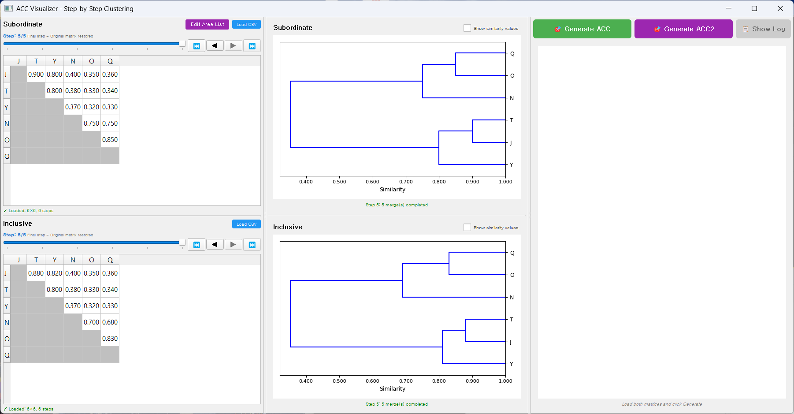
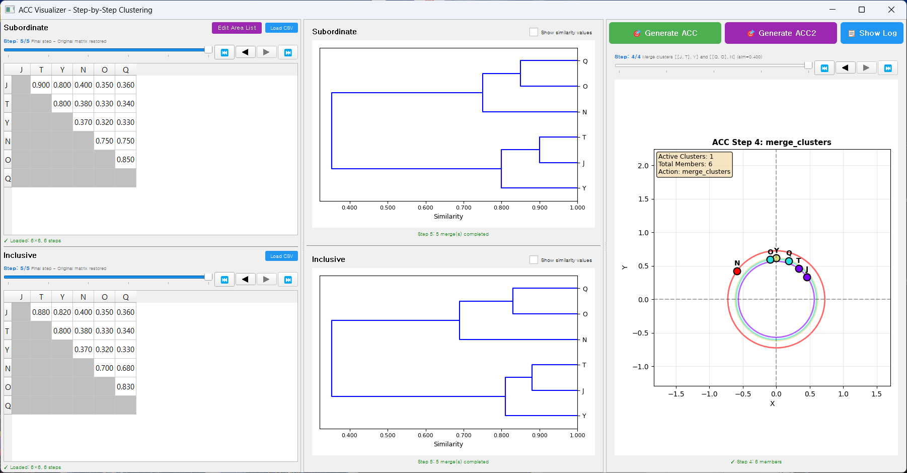

시작하기
========

샘플 데이터로 시작하기
-----------------------

프로젝트에 포함된 샘플 데이터를 사용하여 ACC의 기본 동작을 확인할 수 있습니다.

샘플 데이터 위치
~~~~~~~~~~~~~~~~

* 프로그램 설치 폴더 내 ``data/`` 디렉토리
* ``sample_subordinate.csv``: 6개 영역(J, T, Y, N, O, Q)의 subordinate similarity
* ``sample_inclusive.csv``: 동일한 영역의 inclusive similarity

빠른 시작 절차
~~~~~~~~~~~~~~

1. ACC 프로그램 실행
2. 왼쪽 상단 "Load CSV" 버튼 클릭

   * ``data/sample_subordinate.csv`` 선택
   * 완성된 dendrogram이 중앙 상단에 자동 표시됨

3. 왼쪽 하단 "Load CSV" 버튼 클릭

   * ``data/sample_inclusive.csv`` 선택
   * 완성된 dendrogram이 중앙 하단에 자동 표시됨

4. 오른쪽 패널에서 "Generate ACC Visualization" 버튼 클릭

   * 완성된 ACC 동심원이 자동 표시됨

.. note::

   CSV 로드 후 dendrogram과 ACC가 자동으로 마지막 단계(완성된 상태)로 표시됩니다.
   단계별 과정을 보려면 슬라이더를 왼쪽으로 이동하세요.

기본 워크플로우 이해하기
-------------------------

ACC는 3단계 워크플로우로 구성됩니다:

Step 1: Subordinate Matrix 로드
~~~~~~~~~~~~~~~~~~~~~~~~~~~~~~~~~

1. 왼쪽 패널 상단의 **"Subordinate Similarity Matrix"** 섹션으로 이동
2. **[Load CSV]** 버튼 클릭
3. Subordinate similarity matrix CSV 파일 선택
4. 매트릭스 데이터 확인
5. **Dendrogram 자동 생성 및 표시** - 중앙 패널 상단에 완성된 dendrogram이 즉시 표시됨

자동 처리
^^^^^^^^^

* CSV 파일 검증 (대칭성, 대각선 1.0 체크)
* Hierarchical clustering 수행
* Dendrogram 생성
* 슬라이더 자동으로 마지막 단계로 이동
* 완성된 dendrogram 즉시 표시

Step 2: Inclusive Matrix 로드
~~~~~~~~~~~~~~~~~~~~~~~~~~~~~~~

1. 왼쪽 패널 하단의 **"Inclusive Similarity Matrix"** 섹션으로 이동
2. **[Load CSV]** 버튼 클릭
3. Inclusive similarity matrix CSV 파일 선택
4. 매트릭스 데이터 확인
5. **Dendrogram 자동 생성 및 표시** - 중앙 패널 하단에 완성된 dendrogram이 즉시 표시됨

.. important::

   Subordinate와 Inclusive matrix는 동일한 라벨(지역/객체 이름)을 가져야 합니다.
   로드 후 완성된 dendrogram이 자동으로 표시됩니다. 단계별 과정을 보려면 슬라이더를 조작하세요.

Step 3: ACC 시각화 생성
~~~~~~~~~~~~~~~~~~~~~~~

1. 오른쪽 패널로 이동
2. **[Generate ACC Visualization]** 버튼 클릭
3. ACC 알고리즘 실행
4. **완성된 동심원이 자동으로 표시됨**

또는 ACC2 시각화:

* **[Generate ACC2]** 버튼 클릭하여 개선된 ACC2 알고리즘 사용
* ACC2도 마찬가지로 완성된 시각화가 즉시 표시됨

.. note::

   생성 후 자동으로 마지막 단계(완성된 ACC)가 표시됩니다.
   단계별 클러스터 병합 과정을 보려면 슬라이더를 왼쪽으로 이동하세요.

다음 단계
----------

기본 워크플로우를 이해했다면 :doc:`basic_usage` 로 이동하여 상세한 사용법을 확인하세요.
